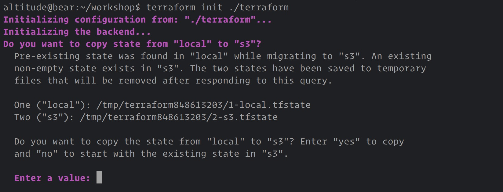

## 2. Remote state

In the previous exercise, you may have noticed Terraform created a `terraform.tfstate` file when running apply. This is where Terraform persists the state of the last-known arguments and attributes for all resources in our configuration. These contents known as "state" can be stored locally as a JSON file (local state) or stored in a remote shared location such as an S3 or GCS bucket (remote state).

Sddssd

State is a very powerful feature of Terraform that allows configuration to easily be shared across machines, team members and continuous integration and deployment environment.

We could check our `.tfstate` file into source control. However this quickly becomes messy when working in a team environment or with continuous integration as state quickly becomes out of sync across machines.

### 2.1 Define a remote backend

First we need to define the backend we would like to use with our project. Open the `backend.tf` file within the `terraform` directory and uncomment it's contents:

```vcl  
terraform {
  backend "s3" {
    bucket = "fastly-altitude-2017"
    key    = "bear/state"
  }
}  
```

> _What's this?_
Backends in Terraform determine where state is stored. For example, the local (default) backend stores state in a local JSON file on disk. The S3 backend stores the state within S3. When using a non-local backend, Terraform will not persist the state anywhere on disk. This behaviour is a major benefit for backends: if sensitive values are in your state, using a remote backend allows you to use Terraform without that state ever being persisted to disk.

### 2.2 Initialize the backend

Terraform must initialize any configured backend before use. This can be done by simply running the [`terraform init`](https://www.terraform.io/docs/commands/init.html) CLI command. 

```
$ terraform init ./terrafom
```

> _What's this?_
The `init` command configures the remote backend and persists the settings to a state file. The command must be called on any new environment that configures a backend or any change of the backend configuration. Terraform will detect when initialization is required and error in that situation. Terraform doesn't auto-initialize because it may require additional information from the user, perform state migrations, etc.

If successful, the command will ask you if you want to copy the existing state to the S3 bucket or start from fresh. We want to answer `yes` to this question.



You may have noticed that we haven't provided Terraform with any AWS credentials to authenticate with S3. Just like Terraform variables, these can be read from a configuration file or from the environment. These values are already exposed in your workstation for you. If running manually you will need to set these variables or pass them in as command line arguments.

### 2.3 Celebrate! 🎉
To confirm that this is correctly configured we can pun `plan` again and notice that it first synchronises the local state with the S3 remote before running the plan.

```sh
$ terraform plan
```
